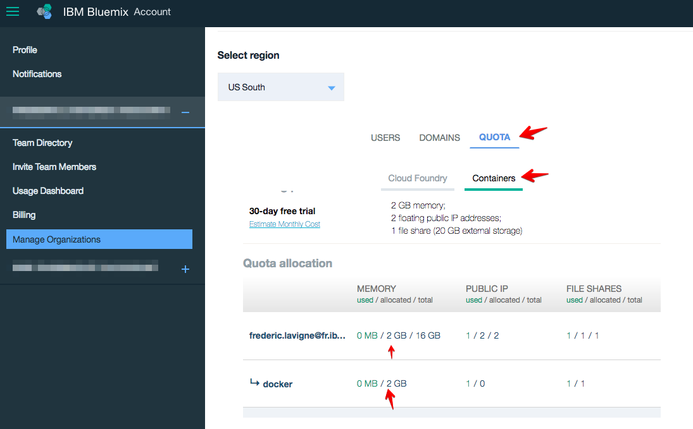

# Deploy the service in Bluemix with the toolchain

This project comes with a partially automated toolchain capable of deploying the service to Cloud Foundry, OpenWhisk and Kubernetes. There is some information you need to get before creating the toolchain.

> Although this section uses a toolchain, it assumes you have successfully configured the Bluemix CLI and its plugins. Some steps require you to use the command line.

> Only the US South region is currently supported.

## Obtain a Bluemix API key

A Bluemix API key is used in place of your Bluemix credentials. It allows to access the Bluemix API. The toolchain uses the API key to interact with the Container Service API.

1. Generate a Bluemix API key

   ```
   bx iam api-key-create for-cli
   ```

   > You can also use an existing API key.

1. Make note of the generated API key. It won't be shown again.

## Get the namespace where you will push the Docker image

1. Check the existing namespaces

   ```
   bx cr namespace-list
   ```

   > You can use any of the namespaces listed.

1. If you want to create a new namespace, use

   ```
   bx cr namespace-add fibonacci
   ```

1. Make note of the namespace. You will need it later.

## Build the Docker image

### with the toolchain

The toolchain is able to build the Docker image but only if you have used IBM Containers in the past - the [*single and scalable containers*](https://console.ng.bluemix.net/docs/containers/cs_classic.html#cs_classic) option before Kubernetes was made available. If you did, you should be familiar with the notion of namespace and quota.

To build the Docker image in the toolchain, you will need to specify a Bluemix space that has quota assigned for IBM Containers. You can find which space has quotas for the IBM Containers by looking at your organization:

  

In the screenshot above, two spaces have Containers quota available. One will need to be selected when creating the toolchain.

### or manually, before creating the toolchain

Go through the steps detailed in the [manual instructions to build the Docker image](DEPLOY_MANUALLY.md#build-the-docker-image).

## Optionally create a Kubernetes cluster

If you don't create a Kubernetes cluster, the toolchain will create one free cluster for you.

To create a cluster manually, refer to [these instructions](DEPLOY_MANUALLY.md#create-a-kubernetes-cluster).

## Create the toolchain

1. Ensure your organization has enough quota for one web application using 256MB of memory, one Kubernetes cluster, and one OpenWhisk action.

1. Click ***Create toolchain*** to start the Bluemix DevOps wizard:

   [](https://console.ng.bluemix.net/devops/setup/deploy/?repository=https://github.com/IBM-Bluemix/multiple-deployment-options&branch=master)

1. Select the **GitHub** box.

1. Decide whether you want to clone or fork the repository.

1. If you decide to Clone, set a name for your GitHub repository.

1. Select the **Delivery Pipeline** box.

1. Select the region, organization and space where you want to deploy the web application. A random route will be used for the application.

   :warning: Make sure the organization and the space have no space in their names.

   :warning: Only the US South region is currently supported.

1. Select the region, organization and space where quota for IBM Containers have been specified. If you never use the IBM Containers before, you may need to build the Docker image outside of the toolchain as explained earlier in this document.

1. Optionally set the Bluemix API key. If you don't set the key, the Fibonacci service will NOT be deployed to a Kubernetes cluster and you will need to use the manual instructions.

1. Optionally set the name of an existing Kubernetes cluster if you have one, if you do NOT have an existing cluster then the toolChain will create one by default.

1. Replace the *<namespace>* value with the namespace where the Docker image has been or will be pushed.

1. Click **Create**.

1. Select the Delivery Pipeline.

1. Wait for the DEPLOY stage to complete.

1. The services are ready. Review the [Service API](#Service_API) to call the services.
